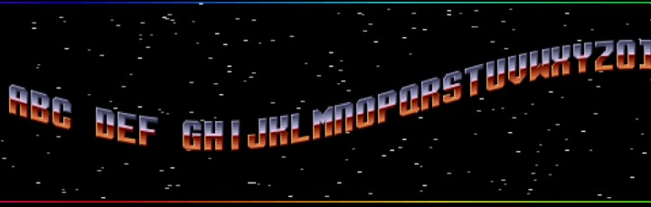

# Twitch-Scroller

An HTML sine scroller, for use as a browser source in Streamlabs OBS.

The original source can be found here: http://slicker.me/javascript/scroll.htm

This version has been modified to allow for arbitrary layouts in the bitmap, and it's now a 1px sine, instead of one character. 

View [live demo](https://tripleeh.github.io/Twitch-Scroller/)

